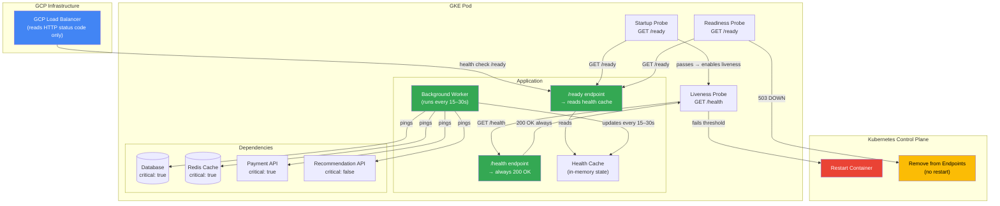
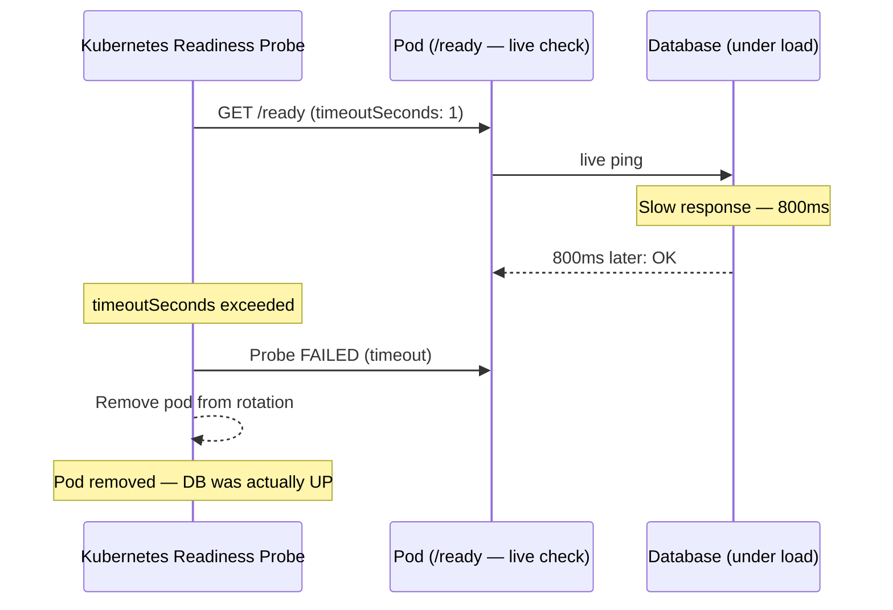
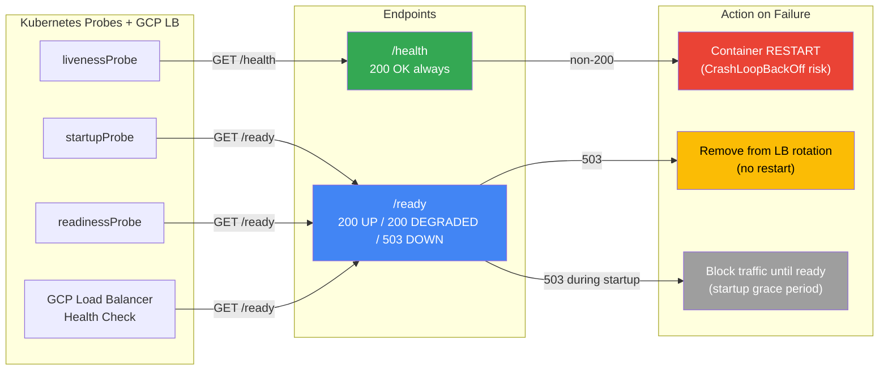
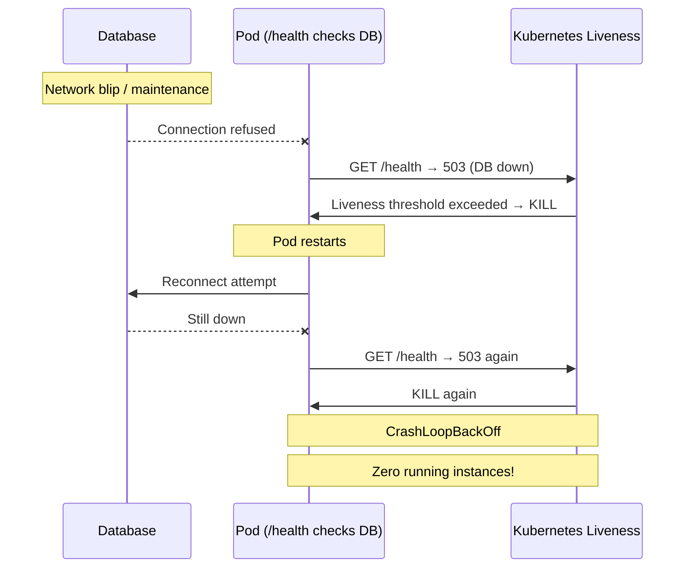
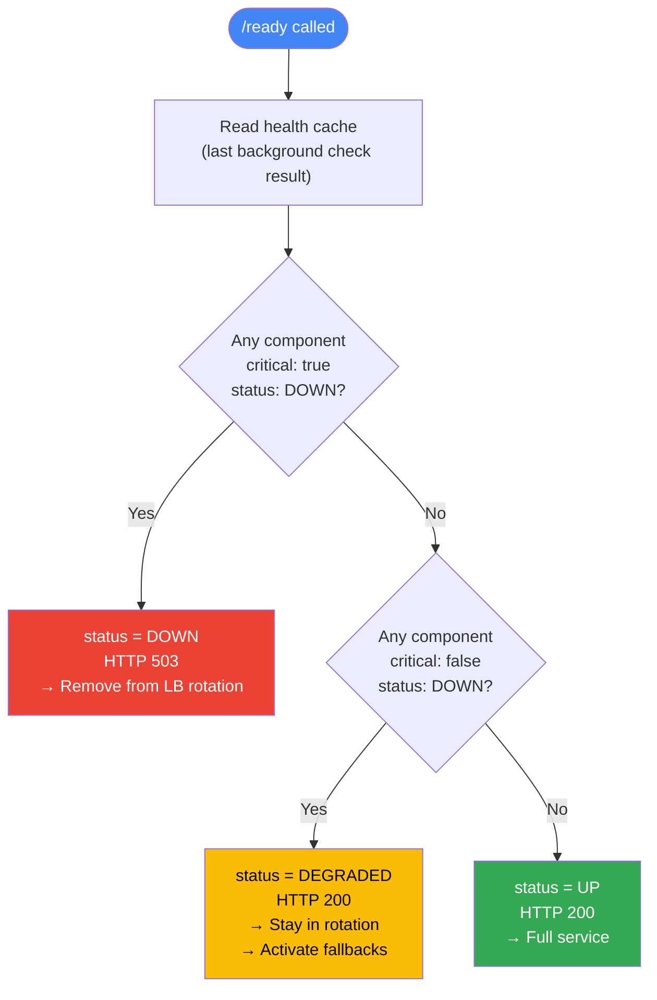

# Multi-Tier Health Check Strategy for GCP Workloads

## Problem Statement

Modern cloud-native applications running on GCP (GKE, Cloud Run) face a fundamental operational challenge: **a single health signal is not enough to describe the state of a running service**.

Without a proper health check strategy, teams encounter:

- **Restart storms**: Kubernetes restarts a healthy container because a downstream database is temporarily unavailable, causing a `CrashLoopBackOff` cascade.
- **Silent degradation**: A service with a broken dependency stays in the load balancer rotation, continuing to serve degraded or errored responses to users.
- **SLA blind spots**: Monitoring only reports "UP" or "DOWN" with no visibility into partial failures, making it impossible to act proactively before a full outage.
- **Slow-start kills**: A container that takes 30 seconds to warm up gets killed by a liveness probe before it ever serves a request.

The core problem is that teams use a single endpoint (often `/health`) for all three concerns — liveness, readiness, and startup — which conflates fundamentally different questions into one signal.

---

## Architecture Overview



---

## Solution Approach

The solution is a **two-endpoint, three-state health model** backed by an **asynchronous background checker** that keeps probe responses fast and non-blocking.

### The Two Questions

| Question | Endpoint | Answered By |
|---|---|---|
| "Is the process alive?" | `/health` | The HTTP server responding at all |
| "Is the service ready to serve traffic?" | `/ready` | Active checks against all dependencies |

### The Three States

| State | HTTP Code | Meaning |
|---|---|---|
| `UP` | `200` | All dependencies healthy |
| `DEGRADED` | `200` | Non-critical dependency down, fallbacks active |
| `DOWN` | `503` | Critical dependency down, cannot serve safely |

### The Asynchronous Pattern

Dependency checks (database pings, API calls) run in a **background worker every 15–30 seconds**. The `/ready` endpoint returns the **last known state from memory** — it never blocks on a live check. This guarantees the probe never times out and never adds latency to the health check pipeline.

---

## Why `/ready` Must Not Run Checks On-Demand

The intuitive alternative to a background worker is to run all dependency checks live on every `/ready` call — probe hits, checks fire, result returns. This is simpler to implement, but creates a set of failure modes that make the health check itself a source of instability.

### Problem 1 — Probe timeout = false-positive pod removal

Kubernetes probes have a hard `timeoutSeconds` limit (default: **1 second**). If a dependency is slow but not dead — a database under load responding in 800ms, an API with a cold-start delay — the live check exceeds the timeout. Kubernetes treats a timed-out probe identically to a failed one: the pod is marked unready and removed from the load balancer.

You now have pods being pulled from rotation not because they are broken, but because a dependency was temporarily slow. This is a **false positive** that reduces capacity exactly when the system is under stress.



### Problem 2 — Cascading load during dependency stress

Health checks run on a fixed schedule across every pod in the fleet. With live checks, every probe call translates directly into a dependency request.

| Fleet size | Probe interval | Live DB pings from health checks alone |
|---|---|---|
| 10 pods | every 15s | ~0.7 req/s |
| 50 pods | every 15s | ~3.3 req/s |
| 100 pods | every 15s | ~6.7 req/s |

A database that is struggling is now receiving additional query load from the very system designed to detect that it is struggling. This can turn a recoverable high-load event into a full outage.

### Problem 3 — PHP-FPM has no persistent background context

Laravel and CakePHP run under **PHP-FPM**, where each request is handled by a short-lived worker process with no shared memory between requests. There is no native place to run a persistent background worker.

If a live check is added to `/ready` in a PHP app, every probe call spawns a new process, opens fresh connections to the database and Redis, performs the check, then tears everything down. Under a degraded scenario where the database is slow, this means:

- Each of the N pods fires a probe every 15 seconds
- Each probe opens a new DB connection (PHP-FPM does not pool across requests)
- The database receives a burst of new connections from health checks at the worst possible time
- Connection pool exhaustion can occur, making a partial failure into a total failure

### Problem 4 — A hanging dependency blocks the probe indefinitely

If a dependency hangs instead of rejecting (e.g. a firewall silently dropping packets, a TCP connection that never closes), a live check will block until `timeoutSeconds` is reached on every single probe call. There is no circuit breaker. Every probe for every pod blocks for the full timeout duration before reporting failure.

### The correct approach for PHP apps

Since PHP-FPM cannot run a true persistent background worker, the recommended pattern is a **lightweight synchronous check with aggressive per-dependency timeouts**:

- Set a hard connect timeout of **300–500ms per dependency** at the socket/driver level
- Keep the total `/ready` response time under **500ms** in all cases
- Increase `timeoutSeconds` on the Kubernetes probe to **3–5 seconds** to absorb variance
- Only check the minimum set of dependencies needed to determine readiness — avoid checking non-critical dependencies inline

This is a practical compromise for PHP. It avoids the persistent worker requirement while bounding the worst-case probe duration. The failure modes above are reduced, not eliminated — which is why Go services should always prefer the background worker pattern using goroutines.

### Comparison

| | Background Worker (Async) | On-Demand (Sync) |
|---|---|---|
| Probe response time | Always O(1) — reads from memory | Depends on slowest dependency |
| False-positive risk | None — timeout-proof | High if any dep responds slowly |
| Load on dependencies during stress | Zero — fixed check interval | Multiplied by fleet size × probe frequency |
| PHP-FPM compatible | Requires workaround | Yes, with tight per-dep timeouts |
| Go compatible | Yes — goroutines | Yes, but not recommended |
| Recommended for | Go services, large fleets | Small PHP services, 1–2 fast local deps |

---

## Probe-to-Endpoint Mapping



---

## Why `/health` Must Stay Simple

The `/health` endpoint is wired to the **Liveness Probe** in Kubernetes. Its only job is to answer: *"Is the process dead or deadlocked?"*

### What happens if you add dependency checks to `/health`



1. Your database goes down temporarily (network blip, maintenance window).
2. `/health` pings the database, gets no response, returns a non-200.
3. The Liveness probe fails its threshold.
4. **Kubernetes kills and restarts the Pod.**
5. The restarted Pod checks the database again — still down.
6. The Pod fails liveness again → `CrashLoopBackOff`.
7. You now have **zero running instances** because of a temporary network issue.

You have converted a recoverable dependency failure into a full service outage triggered by your own infrastructure.

### The rule

> **The Liveness probe must never check external dependencies. It should only verify the process event loop is alive.**

A passing `/health` check should mean nothing more than: *"The HTTP server is running and not deadlocked."*

---

## Why `/ready` Exists

The `/ready` endpoint is wired to the **Readiness Probe** (and the **Startup Probe**) in Kubernetes, and to the **Load Balancer health check** in GCP.

Its job is to answer: *"Should this instance receive traffic right now?"*

When `/ready` returns `503`, Kubernetes removes the Pod from the Service endpoints. The Load Balancer stops routing to it. **The Pod is not restarted** — it simply waits offline until it recovers.

This is the correct behavior for dependency failures:

- Database restarting → Pod waits offline → comes back online automatically when DB recovers.
- External API timing out → Pod stays online if non-critical (DEGRADED) or goes offline if critical (DOWN).
- App still initializing at startup → Pod waits offline until fully ready.

### GKE Probe Configuration

```yaml
startupProbe:
  httpGet:
    path: /ready
    port: 8080
  failureThreshold: 10      # 10 × 5s = 50s grace period before liveness kicks in
  periodSeconds: 5

livenessProbe:
  httpGet:
    path: /health
    port: 8080
  initialDelaySeconds: 0
  periodSeconds: 10
  failureThreshold: 3

readinessProbe:
  httpGet:
    path: /ready
    port: 8080
  periodSeconds: 15
  failureThreshold: 2
```

### GCP Load Balancer

The Load Balancer uses `/ready` as its backend health check. Allow ingress from GCP health check ranges:

- `130.211.0.0/22`
- `35.191.0.0/16`

---

## Endpoint Behavior Reference

### `GET /health`

- **Used by**: Liveness Probe
- **Logic**: Returns `200 OK` if the HTTP process is alive. No dependency checks.
- **Action on failure**: Kubernetes **restarts** the container.
- **Response time**: Always sub-millisecond.

```json
{ "status": "UP" }
```

---

### `GET /ready`

- **Used by**: Readiness Probe, Startup Probe, GCP Load Balancer
- **Logic**: Returns the last known state from the background health cache.
- **Action on 503**: Kubernetes removes Pod from rotation. Load Balancer stops routing. **No restart.**
- **Action on 200**: Pod stays in rotation. If `DEGRADED`, fallback content is served.

---

## Recommended JSON Response Structure

### `UP` — HTTP 200

All critical and non-critical dependencies are healthy.

```json
{
  "status": "UP",
  "timestamp": "2026-04-20T14:30:00Z",
  "components": {
    "database":           { "status": "UP", "latency_ms": 12 },
    "cache_redis":        { "status": "UP", "latency_ms": 3  },
    "payment_api":        { "status": "UP", "latency_ms": 85, "critical": true  },
    "recommendation_api": { "status": "UP", "latency_ms": 45, "critical": false }
  }
}
```

---

### `DEGRADED` — HTTP 200

A non-critical dependency is down. Instance stays in rotation. Fallback is active.

```json
{
  "status": "DEGRADED",
  "timestamp": "2026-04-20T14:30:00Z",
  "components": {
    "database":           { "status": "UP",   "latency_ms": 12,  "critical": true  },
    "cache_redis":        { "status": "UP",   "latency_ms": 3,   "critical": true  },
    "payment_api":        { "status": "UP",   "latency_ms": 85,  "critical": true  },
    "recommendation_api": { "status": "DOWN", "critical": false, "error": "504 Gateway Timeout" }
  }
}
```

---

### `DOWN` — HTTP 503

At least one critical dependency is down. Instance is pulled from the Load Balancer.

```json
{
  "status": "DOWN",
  "timestamp": "2026-04-20T14:30:00Z",
  "components": {
    "database":           { "status": "DOWN", "critical": true,  "error": "Connection refused" },
    "cache_redis":        { "status": "UP",   "latency_ms": 3,   "critical": true  },
    "payment_api":        { "status": "UP",   "latency_ms": 85,  "critical": true  },
    "recommendation_api": { "status": "UP",   "latency_ms": 45,  "critical": false }
  }
}
```

---

### Field Reference

| Field | Type | Required | Purpose |
|---|---|---|---|
| `status` | `UP` / `DEGRADED` / `DOWN` | Yes | Top-level signal for Load Balancer and probes |
| `timestamp` | ISO 8601 string | Yes | When the last background check ran |
| `components.<name>.status` | `UP` / `DOWN` | Yes | Per-dependency state |
| `components.<name>.critical` | boolean | Yes | Drives the status escalation logic |
| `components.<name>.latency_ms` | number | No | Useful for latency SLIs and dashboards |
| `components.<name>.error` | string | No | Error message when status is `DOWN` |

### Field Explanations

**`status`** (top-level)
The single most important field. The Load Balancer and Kubernetes probes act only on the HTTP status code derived from this value — they never parse the JSON body. `DOWN` → HTTP 503 → instance removed from rotation. `DEGRADED` or `UP` → HTTP 200 → instance stays in rotation. Your monitoring dashboards should track this field to distinguish between outages and degraded states.

**`timestamp`**
The time the background worker last completed a dependency check cycle, in ISO 8601 UTC format. This is not the time the `/ready` endpoint was called — it reflects the freshness of the cached state. If this timestamp is stale (older than 2× your check interval), it may indicate the background worker has stalled, which is itself an alert-worthy condition.

**`components.<name>`**
A map of every dependency the application depends on, keyed by a short descriptive name (e.g. `database`, `cache_redis`, `payment_api`). Each entry describes the current state of that one dependency as observed by the most recent background check.

**`components.<name>.status`**
Either `UP` or `DOWN`. Represents whether the background worker was able to successfully reach and interact with that dependency in its last check. This field, combined with `critical`, is what drives the top-level `status` calculation.

**`components.<name>.critical`**
`true` if this dependency is required for the application to serve any correct response at all (e.g. the primary database, the session cache). `false` if the application can continue serving a degraded but acceptable response without it (e.g. a recommendations engine, a non-essential third-party API). **This is a design decision made by the team** — classify carefully. Miscategorising a critical dependency as non-critical means it will never pull the instance out of rotation when it fails.

**`components.<name>.latency_ms`**
Round-trip time in milliseconds for the last successful check against this dependency. Present only when `status` is `UP`. Useful for detecting latency SLI breaches before they escalate to full failures — a dependency that is technically `UP` but responding in 800ms may indicate a problem worth alerting on separately.

**`components.<name>.error`**
Present only when `status` is `DOWN`. Contains the raw error or HTTP status returned by the dependency during the last check (e.g. `"Connection refused"`, `"504 Gateway Timeout"`). This is the first piece of information an on-call engineer will read during incident triage.

---

## Status Decision Flow



## Status Decision Logic

```
for each component in components:
    if component.status == DOWN and component.critical == true:
        → top-level status = DOWN, HTTP 503

if any non-critical component is DOWN:
    → top-level status = DEGRADED, HTTP 200

all components UP:
    → top-level status = UP, HTTP 200
```

| Any `critical: true` DOWN | Any `critical: false` DOWN | Result | HTTP |
|---|---|---|---|
| Yes | — | `DOWN` | `503` |
| No | Yes | `DEGRADED` | `200` |
| No | No | `UP` | `200` |

---

## How to Use the JSON Response

### 1. Load Balancer Health Check
The LB only reads the HTTP status code. `200` keeps the instance in rotation. `503` removes it. No JSON parsing required.

### 2. Kubernetes Probes
Same as the Load Balancer — probes act on the HTTP status code only. The JSON body is for observability tooling.

### 3. GCP Cloud Monitoring — Uptime Check
Point an Uptime Check at `/ready`. Configure response validation to expect `200`. Every `503` response counts against your error budget.

For DEGRADED visibility, create a **Log-based Metric** filtering:
```
jsonPayload.status="DEGRADED"
```
This surfaces degradation events in your dashboards without triggering a "Site Down" alert.

### 4. Application-Level Circuit Breakers
Your application reads the internal health cache at runtime to decide whether to serve a full response or a fallback. When a non-critical component reports `DOWN`, the app activates an alternative code path (e.g. static content, cached response, or a graceful empty state) instead of failing the request. The health cache is updated in the background, so this check is always fast — no live dependency call at request time.

### 5. SLA Reporting
Map each state to an SLA tier for stakeholder reporting:

| State | SLA Tier | Counts as Downtime? |
|---|---|---|
| `UP` | Full Service | No |
| `DEGRADED` | Reduced Feature Set | No (but tracked separately) |
| `DOWN` | Outage | Yes — counts against error budget |

**Error budget example for 99.9% monthly SLA:**
- Allowed downtime per month: `43,200 min × 0.001 = 43.2 minutes`
- Every second your `/ready` returns `503` burns this budget.
- Alert on **burn rate**, not individual failures: trigger if you will exhaust the monthly budget within 24 hours.

### 6. Incident Response
When an on-call engineer receives a DEGRADED or DOWN alert, the `/ready` response body tells them exactly which component failed and what error was returned — without needing to dig through logs first. The `error` field on each component provides the first signal for triage.

---

## Summary

```
/health  →  Liveness only  →  "Is the process alive?"         →  Never touch external deps
/ready   →  Readiness + LB  →  "Should I receive traffic?"    →  Background async checks
```

The separation prevents restart storms, enables graceful degradation, and gives your monitoring stack three distinct signals — UP, DEGRADED, DOWN — to drive alerts, dashboards, and SLA reporting with precision.
